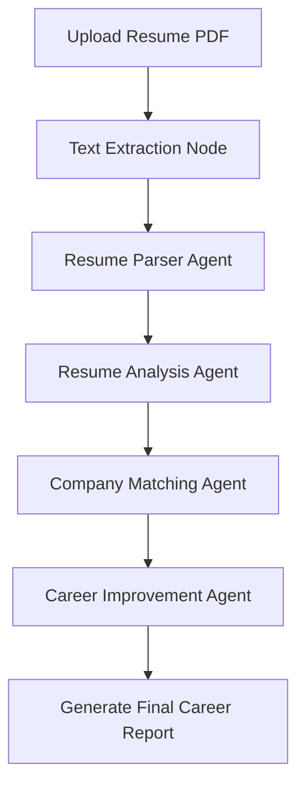

# DBE Copilot AI

An autonomous, multi-agent AI career assistant and placement preparation advisor tailored for MBA students at the **Department of Business Economics (DBE), University of Delhi**. 

CareerCopilot parses student resumes, matches profiles with hiring trends and company requirements, identifies skill gaps, designs 4-week preparation roadmaps, and checks for strict placement compliance format rules.

---

## 🌟 Key Features

### 1. Career Analysis Dashboard
- **Resume Scoring**: Generates an honest resume score out of 100 based on a strict MBA placement grading rubric.
- **Strength & Weakness Analysis**: Evaluates academic achievements, work experience, positions of responsibilities (PORs), and project outcomes.
- **Company Alignment**: Recommends matches against a built-in target database (e.g., American Express, Arcesium, Dolat Capital, United Airlines) across CTC bands.
- **Skill Gap Roadmaps**: Auto-generates a personalized 4-week learning path with project suggestions to address missing domain-specific skills.

### 2. DBE-DU CV Compliance Checker
- **Format Verification**: Checks compliance with University of Delhi DBE-DU placement layout rules:
  - Validates file naming convention (`Firstname_Lastname_CV.pdf`).
  - Standardizes date formats (e.g., `Dec'24 – May'25`).
  - Enforces duration notations (e.g., `02 Months`, `08 Weeks`).
  - Checks for and flags trailing full stops (`.`) at the end of bullet points.
- **Arial 12pt Pointer Optimizer**: Analyzes line widths. In the official DBE Excel CV, each bullet point must fit exactly on a single line. The engine warns of bullets under **79 characters** (too much whitespace) or over **105 characters** (will wrap to a second line), and uses AI to automatically rewrite them to the ideal length.

---

## 🛠️ Tech Stack

- **Frontend**: React.js, Vite, Tailwind CSS, Axios, React Router.
- **Backend**: Python FastAPI, LangGraph (Agent Orchestration), Groq SDK (running Llama-3.3-70b-versatile), PyMuPDF / pdfplumber (PDF extraction), and openpyxl (Excel parsing and reconstruction).

---

## 🤖 Multi-Agent Architecture

CareerCopilot orchestrates tasks using **LangGraph** in a structured, sequential workflow:



### Agents & Responsibilities:
1. **Resume Parser Agent**: Extracts raw text into structured JSON fields (Education, Projects, Work Exp, PORs, Achievements, Skills).
2. **Resume Analysis Agent**: Scores the CV based on CGPA tier, brand value of companies, leadership POR level, quantitative metrics, and target roles.
3. **Company Matching Agent**: Evaluates domain-specific skill alignment (focusing on specialist skills like *Fund Accounting* or *Credit Rating* rather than generic skills like *Excel*).
4. **Career Improvement Agent**: Constructs the 4-week roadmap and recommends resume bullet updates.
5. **Format/Compliance Check Engine**: Independent validation pipeline checking character constraints and template compliance.

---

## 📁 Directory Structure

```text
careercopilot/
├── backend/                  # FastAPI Backend
│   ├── app/
│   │   ├── agents/          # LangGraph agents (manager, resume, company, compliance, dbe)
│   │   ├── api/             # API routes (/resume, /career)
│   │   ├── data/            # Mock company DB (companies.json)
│   │   ├── models/          # Pydantic schemas (schemas.py)
│   │   └── tools/           # Excel generator, PDF extractors, Vector store mocks
│   ├── uploads/             # Temporary PDF storage
│   ├── requirements.txt     # Python dependencies
│   └── .env.example         # Template for environment variables
├── frontend/                 # React Frontend
│   ├── src/
│   │   ├── api/             # Axios API client (client.js)
│   │   ├── pages/           # Upload, Dashboard, CVReport, Landing
│   │   └── App.jsx          # Route configurations
│   ├── package.json         # NPM packages and scripts
│   └── tailwind.config.js   # Style config
└── CLAUDE.md                 # Project background & commands cheat sheet
```

---

## 🚀 Getting Started

### Prerequisites
- Node.js (v18+)
- Python 3.10+
- A Groq API Key

### Backend Setup
1. Navigate to the backend folder:
   ```bash
   cd backend
   ```
2. Create and activate a virtual environment:
   ```bash
   python3 -m venv venv
   source venv/bin/activate
   ```
3. Install dependencies:
   ```bash
   pip install -r requirements.txt
   ```
4. Configure environment variables:
   ```bash
   cp .env.example .env
   ```
   Open the `.env` file and insert your `GROQ_API_KEY`.
5. Run the FastAPI development server:
   ```bash
   uvicorn app.main:app --reload --port 8000
   ```
   The backend will be live at `http://localhost:8000`. You can inspect the interactive docs at `http://localhost:8000/docs`.

### Frontend Setup
1. Navigate to the frontend folder:
   ```bash
   cd ../frontend
   ```
2. Install npm packages:
   ```bash
   npm install
   ```
3. Run the Vite development server:
   ```bash
   npm run dev
   ```
   The app will be accessible at `http://localhost:5173`.

---

## 🔮 Future Roadmap
- **Interactive Mock Interviews**: Dynamic Q&A coach generation based on company profile and resume gaps.
- **Direct Excel Export**: Utilizing the `excel_generator.py` module to generate a fully styled, compliant DBE CV spreadsheet (`.xlsx`) matching university templates out of the box.
- **RAG Integration**: Powering company matching via ChromaDB / FAISS search over a larger database of placement brochures and job descriptions.
